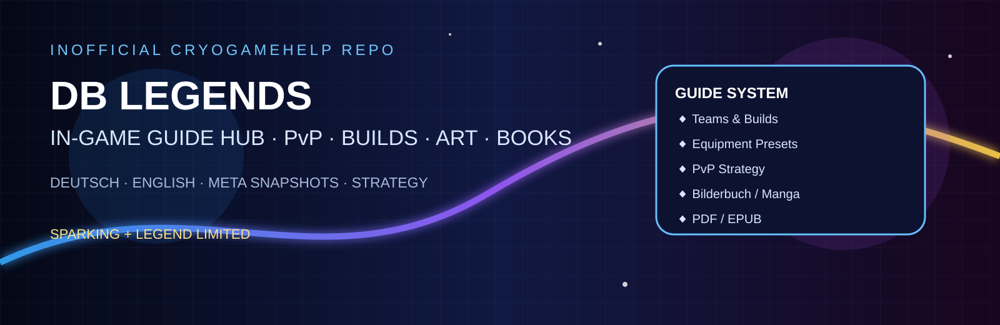
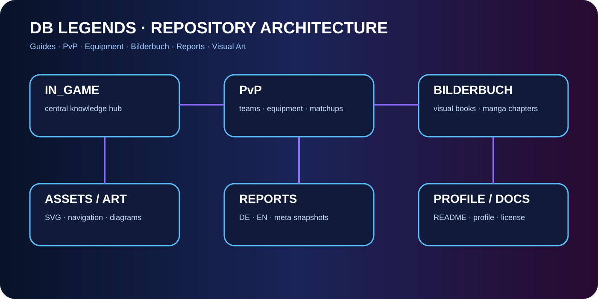
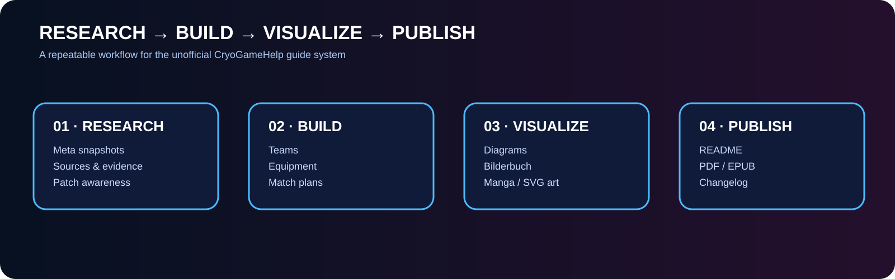

# DB Legends Art Hub

  

  
  

## Visual system

| Asset | Purpose |
|---|---|
| `repo-hero.svg` | In-Game Guide Hub hero |
| `repo-hero-github.svg` | Repository-wide GitHub hero |
| `repo-architecture.svg` | Repository structure visualization |
| `pipeline.svg` | Research → Build → Visualize → Publish workflow |
| `team-core.svg` | Recommended three-unit core |
| `six-team-overview.svg` | Six SPARKING/LL team variants |
| `meta-flow.svg` | PvP opening → endgame flow |
| `rank-roadmap.svg` | Platinum → Diamond roadmap |
| `book-cover.svg` | Bilderbuch identity |

## Art direction

Dark sci-fi / cyber-anime documentation. Blue and violet convey energy and navigation; gold highlights LEGEND LIMITED; red/green/purple labels represent team color context.

The artwork is designed to function as documentation UI: every major illustration has descriptive alt text in the consuming README where applicable.

## Rights

Original diagrams and layouts are repository artwork. Dragon Ball Legends names, characters, logos, screenshots, and game assets remain with their respective rights holders. See the repository `LICENSE.md` for the licensing and third-party rights policy.
