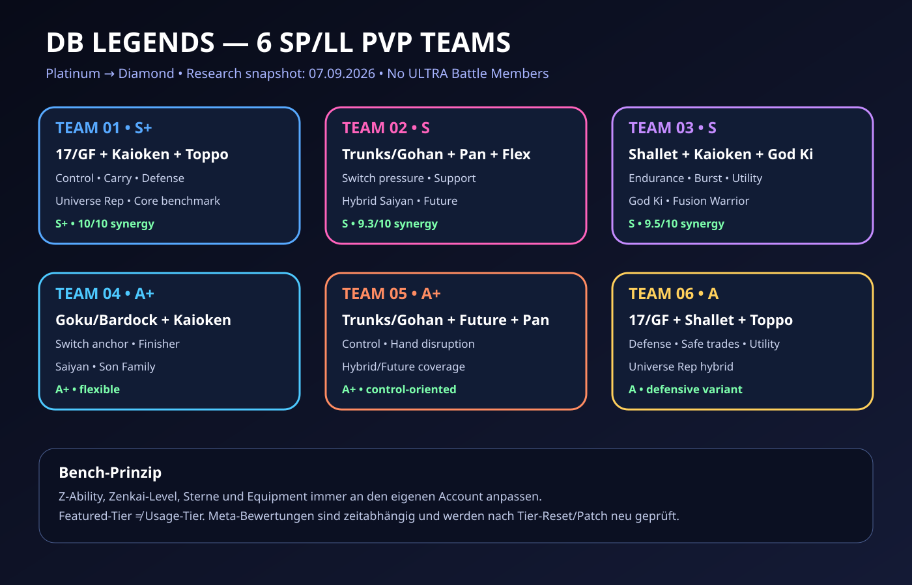
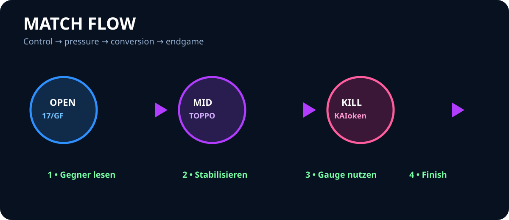

# DB Legends In-Game Assets

## Visual Asset System

The asset set is integrated across the repository README, language entry points, profile, In-Game hub, and Art Hub. SVG is used for versionable, dependency-free GitHub rendering.

## Hero & Cover

  

  

- `repo-hero-github.svg` — repository-wide GitHub hero
- `book-cover.svg` — Bilderbuch / manga guide cover identity
- `repo-hero.svg` — In-Game Guide Hub hero

## Documentation Visuals

  
  

  
  

  
  

### Complete asset index

| Asset | Purpose |
|---|---|
| `repo-hero-github.svg` | repository hero |
| `repo-hero.svg` | In-Game hero |
| `book-cover.svg` | Bilderbuch cover |
| `repo-architecture.svg` | repository structure |
| `pipeline.svg` | content production pipeline |
| `team-core.svg` | core team roles |
| `six-team-overview.svg` | six team overview |
| `meta-flow.svg` | PvP match flow |
| `rank-roadmap.svg` | rank progression |

## Design System

- Dark sci-fi background
- Blue / violet / pink energy accents
- Gold reserved for LEGEND LIMITED emphasis
- Red / green / purple for team-color context
- High contrast and descriptive alternative text
- Relative paths only; no external CDN, fonts, or build dependency

## Accessibility

Every integrated image uses descriptive `alt` text. Visuals supplement the surrounding text and are never the sole carrier of essential instructions.

## Rights

These SVGs are original repository documentation artwork. They are not official game assets and do not replace official Dragon Ball Legends artwork. Character names, logos, screenshots, and game assets remain with their respective rights holders. See `../../../../LICENSE.md` and `../../../..//ART.md` for project rights guidance.
