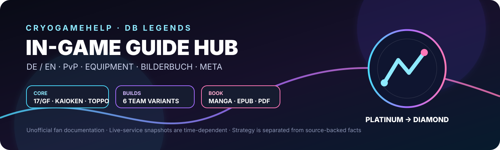

# Repository Profile · DB Legends

<p align="center">
  
</p>

## DE · Profil

**Projekt:** Inoffizieller DB Legends In-Game Guide Hub  
**Schwerpunkt:** SPARKING + LEGEND LIMITED PvP · Platinum → Diamond  
**Dokumentation:** Team-Builds · Equipment · Bilderbuch · Meta-Snapshots · Visuals

### Kernteam

```text
Android #17 & Golden Frieza   →   SSGSS Kaioken Goku   →   God of Destruction Toppo
     Leader / Control                  Carry                    Tank / Disruption
          BLU/GRN                        PUR                           RED
```

### Dokumentationsqualität

- klare Trennung von **Fakten** und **strategischer Bewertung**
- zeitgestempelter Live-Service-Kontext
- deutsche und englische Reports
- visuelle SVG-Navigation ohne externe CDN-Abhängigkeiten
- Equipment-Konfigurationen für Burst, Balanced und Fortress

### Visuelle Navigation

<p align="center">
  
  
</p>

## EN · Profile

**Project:** Unofficial DB Legends In-Game Guide Hub  
**Focus:** SPARKING + LEGEND LIMITED PvP · Platinum → Diamond  
**Documentation:** Team builds · Equipment · Picture book · Meta snapshots · Visuals

### Core philosophy

The guide treats current meta information as a **time-dependent snapshot** and keeps it separate from strategic judgement. It is designed for quick navigation, reproducible build decisions, and readable documentation.

### Repository map

- `DB_Legends/In_Game/` — in-game documentation hub
- `DB_Legends/In_Game/PvP/` — team and equipment guides
- `DB_Legends/In_Game/Bilderbuch/` — German picture-book / manga chapters
- `DB_Legends/In_Game/Assets/` — accessible SVG visual system
- `reports/` — detailed DE/EN research reports

## Maintainer notes

This profile page is a repository-facing project overview, not a GitHub personal profile README. GitHub personal profile READMEs require a public repository matching the username. citehttps://docs.github.com/en/account-and-profile/how-tos/profile-customization/managing-your-profile-readme

**Snapshot:** 7 September 2026
