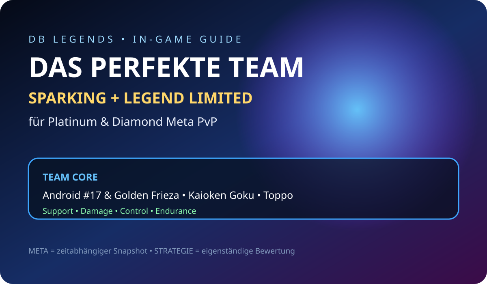
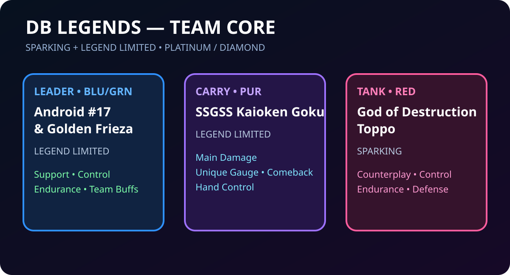
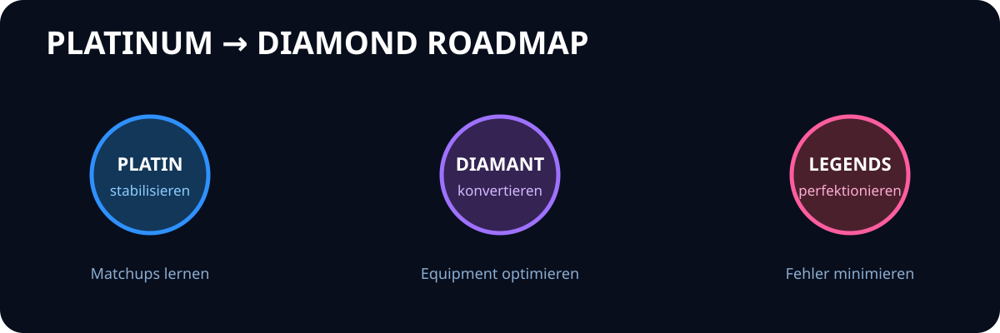

  

<h1 align="center">CRYOGAMEHELP · Universal Game Hub</h1>

<strong>Guides · Builds · Decks · PvP/PvE · Meta · Progression · Events · Visual Documentation</strong>

  <a href="README_DE.md">Deutsch</a> · <a href="README_EN.md">English</a> ·
  <a href="GAMES/README.md">Games</a> · <a href="PROFILE.md">Profile</a> ·
  <a href="LICENSE.md">License</a> · <a href="ART.md">Art</a>

  

## Universal hub

CRYOGAMEHELP is evolving from a single-game guide into a **multi-game knowledge repository**. Existing Dragon Ball Legends research remains intact while dedicated modules are added for Pokémon TCG Pocket, Pokémon TCG Live and Pokémon GO.

### Game matrix

| Game | Module | Main focus |
|---|---|---|
| **Dragon Ball Legends** | [`DB_Legends/`](DB_Legends/) | PvP · Teams · Equipment · Bilderbuch · Meta |
| **Pokémon TCG Pocket** | [`GAMES/Pokemon_TCG_Pocket/`](GAMES/Pokemon_TCG_Pocket/) | Collection · 20-card decks · Battles · Expansions |
| **Pokémon TCG Live** | [`GAMES/Pokemon_TCG_Live/`](GAMES/Pokemon_TCG_Live/) | Deck building · Legality · Ladder · Strategy |
| **Pokémon GO** | [`GAMES/Pokemon_GO/`](GAMES/Pokemon_GO/) | Catching · Raids · GO Battle League · Events |

### Shared documentation architecture

`Overview → Guides → Builds → Meta → Progression → Events → Assets → Reports`

  

### Current modules

- [`GAMES/`](GAMES/README.md) — universal game index and reusable module standard
- [`Pokémon TCG Pocket`](GAMES/Pokemon_TCG_Pocket/README.md) — mobile TCG collection and battle module
- [`Pokémon TCG Live`](GAMES/Pokemon_TCG_Live/README.md) — digital TCG deck and competitive module
- [`Pokémon GO`](GAMES/Pokemon_GO/README.md) — location-based collection, raid and PvP module
- [`Dragon Ball Legends`](DB_Legends/In_Game/README.md) — established full guide hub

## Quality model

**FACTS → SOURCES → ANALYSIS → BUILD → TEST → UPDATE**

Live-service facts are dated and sourced. Strategic recommendations are marked as analysis and are not presented as official rankings.

## Existing DB Legends visual system

  
  

→ [DB Legends Art Hub](DB_Legends/In_Game/Assets/ART_HUB.md)

## Rights

CRYOGAMEHELP is an unofficial fan/documentation project. Game names, characters, logos, screenshots and proprietary game assets remain with their respective rights holders. Original repository documentation and original SVG layouts are covered by `LICENSE.md` unless otherwise stated.

**Architecture snapshot:** 7 September 2026
