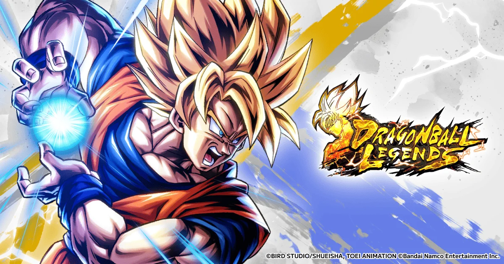

<p align="center"><a href="https://cryogamehelp.pierrepriv99.chatgpt.site/"></a></p>

<h1 align="center">CRYOGAMEHELP</h1>
<p align="center"><strong>Your next level starts here.</strong><br>Independent game guides, teams, decks, and strategies.</p>
<p align="center"><a href="https://cryogamehelp.pierrepriv99.chatgpt.site/"><strong>OPEN THE GAME HELP WEBSITE →</strong></a></p>
<p align="center"><a href="README_DE.md">Deutsch</a> · <a href="README_EN.md">English</a> · <a href="README_FR.md">Français</a> · <a href="docs/README.md">Website development</a> · <a href="LICENSE.md">License</a> · <a href="docs/assets/README.md">Image credits</a></p>

## Four games. One place to improve.

| Game | What you can learn | Repository module |
|---|---|---|
| **Dragon Ball Legends** | Battle cores, bench support, switching, equipment, resource planning | [Legends guides](DB_Legends/In_Game/) |
| **Pokémon TCG Pocket** | 20-card decks, collection goals, consistent battle plans | [Pocket guides](GAMES/Pokemon_TCG_Pocket/) |
| **Pokémon TCG Live** | 60-card decks, format checks, crafting, practice | [Live guides](GAMES/Pokemon_TCG_Live/) |
| **Pokémon GO** | Raid preparation, moves, GO Battle League, progression | [GO guides](GAMES/Pokemon_GO/) |

## Ready to use

The [website](https://cryogamehelp.pierrepriv99.chatgpt.site/) includes a fully translated **English / German / French** interface, eight practical guides, authentic game images and screenshots, search, category filters, saved guides, and independent plans for each game.

Build a six-member team or a 20-/60-card deck, add your own entries, edit quantities, and export the result. Plans and preferences stay in your browser on the current device. The planner helps organize ideas; exact card editions, format legality, abilities, and team synergy still need review in game.

## Run or contribute

```sh
npm ci
npm start
```

Open **http://localhost:4173**. For content, translation, asset, and test instructions, see [the website README](docs/README.md). The current live website is hosted with Sites. GitHub Actions checks the responsive layouts and deploys to GitHub Pages on `main`; the repository owner must enable Pages once with **GitHub Actions** as its source. See [deployment setup](docs/README.md#deployment).

Contributions are welcome: improve a guide, add a source, correct a translation, or report a problem through [GitHub Issues](https://github.com/Pierreg99/inoffical-cryogamehelp-repo/issues).

## Documentation and research

The original game modules, diagrams, equipment notes, and [research reports](reports/) remain available. Time-sensitive research keeps its original snapshot date and should be checked against current in-game information. Website guides explain evergreen principles and do not claim to be live meta rankings.

**Shared structure:** Overview → Guides → Builds → Meta → Progression → Events → Assets → Reports.

## Credits and rights

CRYOGAMEHELP is an **unofficial fan project**, independent of game publishers. Dragon Ball and Pokémon names, artwork, screenshots, and trademarks belong to their respective rights holders. Third-party game images are not relicensed under MIT; [every image source is recorded](docs/assets/sources.json). Original code and repository documentation use the [MIT license](LICENSE.md). Self-hosted fonts include their SIL Open Font License notices.
