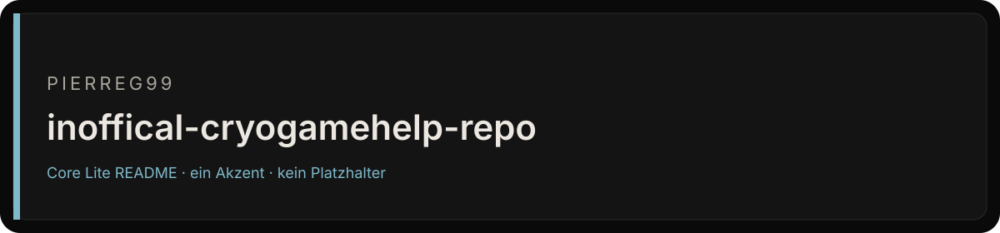
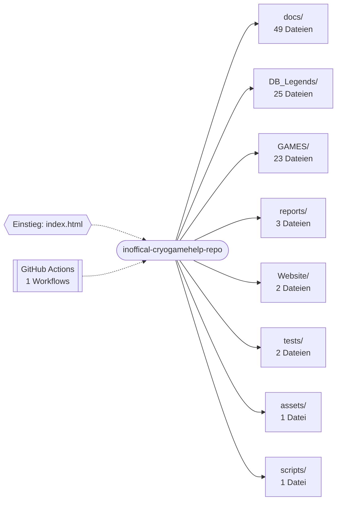

<div align="center">



# inoffical-cryogamehelp-repo

<p><strong>Inoffizielle Spielhilfe für vier Spiele mit Guides und Lernmodulen an einem Ort.</strong></p>
<p>


</p>
<p>
<a href="https://github.com/Pierreg99/inoffical-cryogamehelp-repo/actions/workflows/pages.yml"></a>
</p>
<p><a href="#schnellstart">Schnellstart</a> · <a href="#projektstruktur">Projektstruktur</a> · <a href="#english-summary">English</a></p>
</div>

<table>
<tr>
<td width="58%" valign="top">

### Bestand

Keine Beschreibung im Repo-Metadatum. Dieses README erfindet deshalb keine Funktionen, Releases oder Laufzeiten.

Der Default-Branch `main` ist die Fläche, die zählt. Was nicht in diesem Baum liegt, ist kein Feature dieses Repos.

</td>
<td width="42%" valign="top">

### Fakten

| Feld | Wert |
| --- | --- |
| Owner | Pierreg99 |
| Branch | `main` |
| Sichtbarkeit | öffentlich |
| Sprache | JavaScript |
| Archiv | nein |

</td>
</tr>
</table>

---

## Inhaltsverzeichnis

- [Bestand und Fakten](#bestand)
- [Überblick](#überblick)
- [Features](#features)
- [Schnellstart](#schnellstart)
- [Architektur](#architektur)
- [Projektstruktur](#projektstruktur)
- [Dokumentation](#dokumentation)
- [Projektdetails](#projektdetails)
- [English summary](#english-summary)
- [Lizenzhinweis](#lizenzhinweis)

## Überblick

Inoffizielle Spielhilfe für vier Spiele mit Guides und Lernmodulen an einem Ort.

| Merkmal | Wert |
| --- | --- |
| Sprachen | JavaScript (93%), HTML (7%) |
| Dateien im Repository | 124 |
| Einstiegspunkte | `index.html` |
| Version (`package.json`) | 2.0.0 |
| CI-Workflows | 1 |
| Lizenz | [LICENSE.md](LICENSE.md) |

## Features

- End-to-End-Tests mit Playwright
- Lokale Speicherung im Browser (localStorage)
- Echtzeit-Render-Schleife (requestAnimationFrame)
- Automatisierung über GitHub Actions: `pages.yml`
- Veröffentlichung über GitHub Pages
- 2 Testdateien im Repository
- 18 SVG-Grafiken
- 51 Markdown-Dokumente

## Schnellstart

```bash
git clone https://github.com/Pierreg99/inoffical-cryogamehelp-repo.git
cd inoffical-cryogamehelp-repo
```

**Node.js**

```bash
npm install
npm start
npm run test
npm run check
```

<details>
<summary>Alle Skripte aus <code>package.json</code></summary>

| Skript | Befehl |
| --- | --- |
| `start` | `node scripts/serve.mjs` |
| `check` | `node --check docs/app.js && node --check docs/data.js && node --check docs/i18n.js` |
| `test` | `playwright test` |

</details>

## Architektur

Übersicht der wichtigsten Verzeichnisse nach Anzahl der enthaltenen Dateien.


```mermaid
flowchart LR
    R(["inoffical-cryogamehelp-repo"])
    R --> D0["docs/<br/>49 Dateien"]
    R --> D1["DB_Legends/<br/>25 Dateien"]
    R --> D2["GAMES/<br/>23 Dateien"]
    R --> D3["reports/<br/>3 Dateien"]
    R --> D4["Website/<br/>2 Dateien"]
    R --> D5["tests/<br/>2 Dateien"]
    R --> D6["assets/<br/>1 Datei"]
    R --> D7["scripts/<br/>1 Datei"]
    E{{"Einstieg: index.html"}}
    E -.-> R
    CI[["GitHub Actions<br/>1 Workflows"]] -.-> R
```

## Projektstruktur

```text
inoffical-cryogamehelp-repo/
├── .github/  (1 Datei)
│   └── workflows/
├── assets/  (1 Datei)
│   └── readme-banner.svg
├── DB_Legends/  (25 Dateien)
│   ├── Bilderbuch/
│   └── In_Game/
├── docs/  (49 Dateien)
│   ├── assets/
│   ├── .nojekyll
│   ├── app.js
│   ├── data.js
│   ├── i18n.js
│   ├── index.html
│   └── … (2 weitere)
├── GAMES/  (23 Dateien)
│   ├── Assets/
│   ├── Pokemon_GO/
│   ├── Pokemon_TCG_Live/
│   ├── Pokemon_TCG_Pocket/
│   ├── DATA_MODEL.md
│   ├── GAME_MODULE_TEMPLATE.md
│   └── … (3 weitere)
├── reports/  (3 Dateien)
│   ├── DB_Legends_PvP_Meta_Report_DE.md
│   ├── DB_Legends_PvP_Meta_Report_EN.md
│   └── DB_Legends_PvP_Meta_Report_INDEX.md
├── scripts/  (1 Datei)
│   └── serve.mjs
├── tests/  (2 Dateien)
│   ├── hub.spec.js
│   └── layout.spec.js
├── Website/  (2 Dateien)
│   ├── index.html
│   └── README.md
├── .gitignore
├── ART.md
├── CHANGELOG.md
├── index.html
├── LICENSE.md
├── package-lock.json
├── package.json
├── playwright.config.js
├── PROFILE.md
├── PROFILE_DE.md
├── PROFILE_EN.md
├── README.md
├── README_DE.md
└── … (2 weitere Einträge)
```

## Dokumentation

- [ART.md](ART.md)
- [CHANGELOG.md](CHANGELOG.md)
- [LICENSE.md](LICENSE.md)
- [PROFILE.md](PROFILE.md)
- [PROFILE_DE.md](PROFILE_DE.md)
- [PROFILE_EN.md](PROFILE_EN.md)
- [README_DE.md](README_DE.md)
- [README_EN.md](README_EN.md)
- [README_FR.md](README_FR.md)
- [docs/README.md](docs/README.md)

## Projektdetails

Der folgende Abschnitt übernimmt die bisherige Projektdokumentation.

<p align="center"><a href="https://pierreg99.github.io/inoffical-cryogamehelp-repo/"></a></p>

<h1 align="center">CRYOGAMEHELP</h1>
<p align="center"><strong>Your next level starts here.</strong><br>Independent game guides, teams, decks, and strategies.</p>
<p align="center"><a href="https://pierreg99.github.io/inoffical-cryogamehelp-repo/"><strong>OPEN THE GAME HELP WEBSITE →</strong></a></p>
<p align="center"><a href="README_DE.md">Deutsch</a> · <a href="README_EN.md">English</a> · <a href="README_FR.md">Français</a> · <a href="docs/README.md">Website development</a> · <a href="LICENSE.md">License</a> · <a href="docs/assets/README.md">Image credits</a></p>

## Four games. One place to improve.

| Game | What you can learn | Repository module |
|---|---|---|
| **Dragon Ball Legends** | Battle cores, bench support, switching, equipment, resource planning | [Legends guides](DB_Legends/In_Game/) |
| **Pokémon TCG Pocket** | 20-card decks, collection goals, consistent battle plans | [Pocket guides](GAMES/Pokemon_TCG_Pocket/) |
| **Pokémon TCG Live** | 60-card decks, format checks, crafting, practice | [Live guides](GAMES/Pokemon_TCG_Live/) |
| **Pokémon GO** | Raid preparation, moves, GO Battle League, progression | [GO guides](GAMES/Pokemon_GO/) |

## Ready to use

The [website](https://pierreg99.github.io/inoffical-cryogamehelp-repo/) includes a fully translated **English / German / French** interface, eight practical guides, authentic game images and screenshots, search, category filters, saved guides, and independent plans for each game.

Build a six-member team or a 20-/60-card deck, add your own entries, edit quantities, and export the result. Plans and preferences stay in your browser on the current device. The planner helps organize ideas; exact card editions, format legality, abilities, and team synergy still need review in game.

## Run or contribute

```sh
npm ci
npm start
```

Open **http://localhost:4173**. For content, translation, asset, and test instructions, see [the website README](docs/README.md). The live website is hosted on GitHub Pages. GitHub Actions checks the responsive layouts and publishes `docs/` on every push to `main`. See [deployment details](docs/README.md#deployment).

Contributions are welcome: improve a guide, add a source, correct a translation, or report a problem through [GitHub Issues](https://github.com/Pierreg99/inoffical-cryogamehelp-repo/issues).

## Documentation and research

The original game modules, diagrams, equipment notes, and [research reports](reports/) remain available. Time-sensitive research keeps its original snapshot date and should be checked against current in-game information. Website guides explain evergreen principles and do not claim to be live meta rankings.

**Shared structure:** Overview → Guides → Builds → Meta → Progression → Events → Assets → Reports.

## Credits and rights

CRYOGAMEHELP is an **unofficial fan project**, independent of game publishers. Dragon Ball and Pokémon names, artwork, screenshots, and trademarks belong to their respective rights holders. Third-party game images are not relicensed under MIT; [every image source is recorded](docs/assets/sources.json). Original code and repository documentation use the [MIT license](LICENSE.md). Self-hosted fonts include their SIL Open Font License notices.

## English summary

Unofficial game help for four games with guides and learning modules in one place.

Clone the repository and follow the commands in [Schnellstart](#schnellstart); the [project layout](#projektstruktur) shows where the code lives. Further documents are listed under [Dokumentation](#dokumentation).

## Lizenzhinweis

Siehe [LICENSE.md](LICENSE.md).
