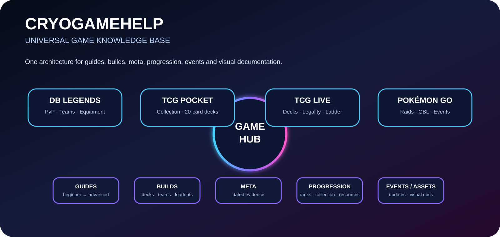

# CRYOGAMEHELP · Universal Game Hub

<strong>Games · Guides · Builds · Decks · Meta · Progression · Events · Visuals</strong>

## Deutscher Einstieg

CRYOGAMEHELP ist jetzt als **universelles Gaming-Wissensrepository** aufgebaut. Das bestehende Dragon-Ball-Legends-Modul bleibt erhalten; neue eigenständige Module ergänzen Pokémon TCG Pocket, Pokémon TCG Live und Pokémon GO.

### Game Hub

| Spiel | Schwerpunkt | Einstieg |
|---|---|---|
| **Dragon Ball Legends** | PvP · Teams · Equipment · Bilderbuch · Meta | [Modul](DB_Legends/) |
| **Pokémon TCG Pocket** | Sammeln · 20-Karten-Decks · Kämpfe · Erweiterungen | [Modul](GAMES/Pokemon_TCG_Pocket/) |
| **Pokémon TCG Live** | Deckbau · Legalität · Ladder · Strategie | [Modul](GAMES/Pokemon_TCG_Live/) |
| **Pokémon GO** | Fangen · Raids · GO-Kampfliga · Events | [Modul](GAMES/Pokemon_GO/) |

### Gemeinsame Struktur

**Übersicht → Guides → Builds → Meta → Progression → Events → Assets → Reports**

### Schnellzugriff

- [Universal Game Hub](GAMES/README_DE.md)
- [Game Module Template](GAMES/GAME_MODULE_TEMPLATE.md)
- [Dragon Ball Legends](DB_Legends/In_Game/README_DE.md)
- [Pokémon TCG Pocket](GAMES/Pokemon_TCG_Pocket/README_DE.md)
- [Pokémon TCG Live](GAMES/Pokemon_TCG_Live/README_DE.md)
- [Pokémon GO](GAMES/Pokemon_GO/README_DE.md)
- [Visual Art](ART.md)
- [Profil](PROFILE_DE.md)
- [Lizenz](LICENSE.md)

## Dokumentationsstandard

**FAKTEN → QUELLEN → ANALYSE → BUILD → TEST → UPDATE**

Live-Service-Angaben werden mit Datum und Quelle geführt. Strategische Empfehlungen werden als Analyse gekennzeichnet und nicht als offizielle Rangliste dargestellt.

**Architektur-Snapshot:** 7. September 2026
